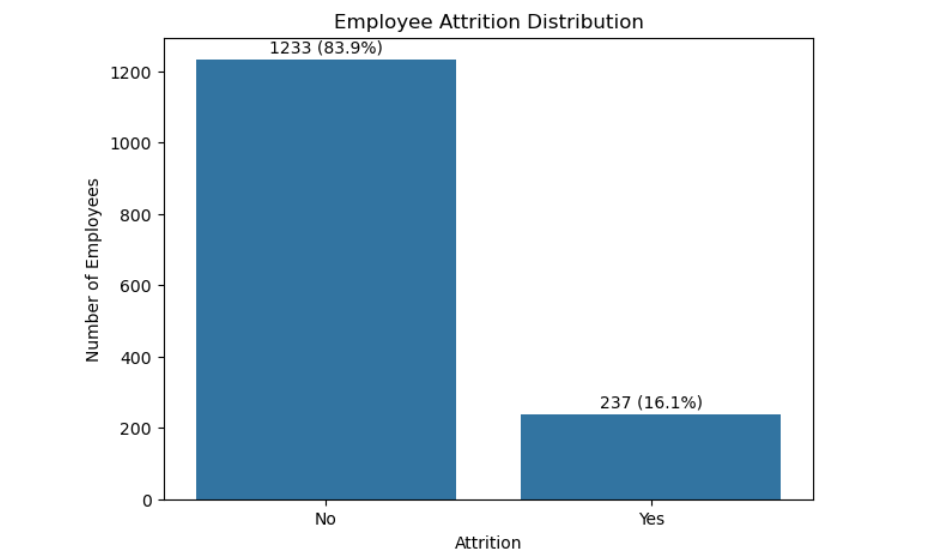
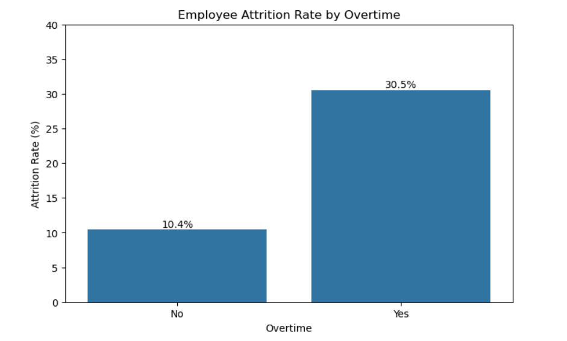
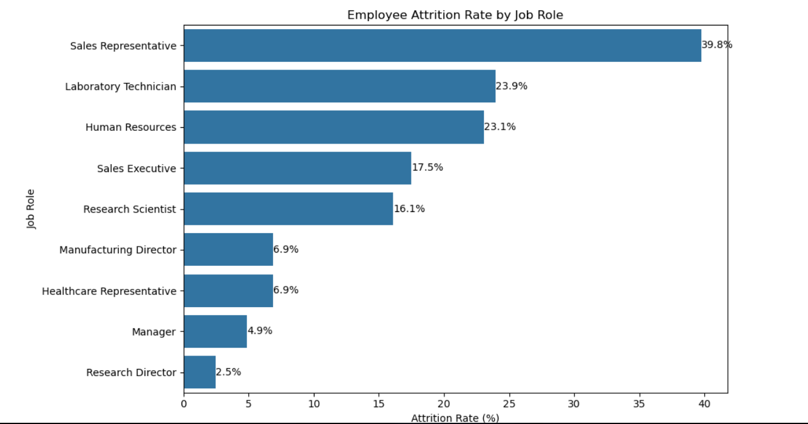
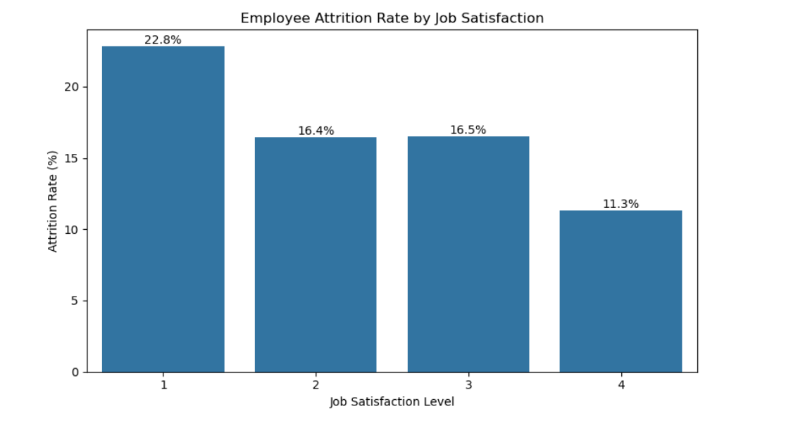
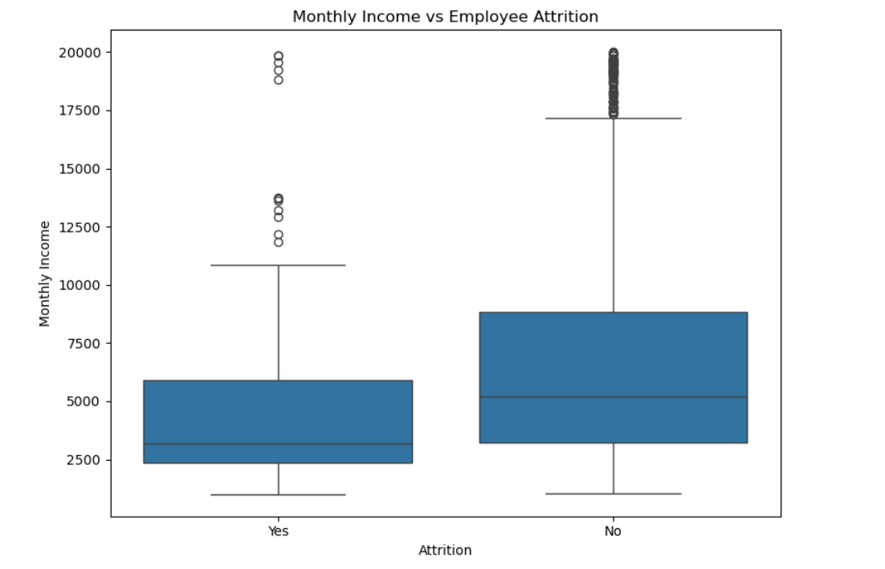
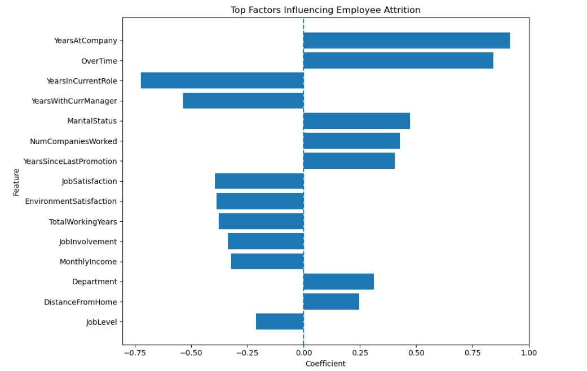
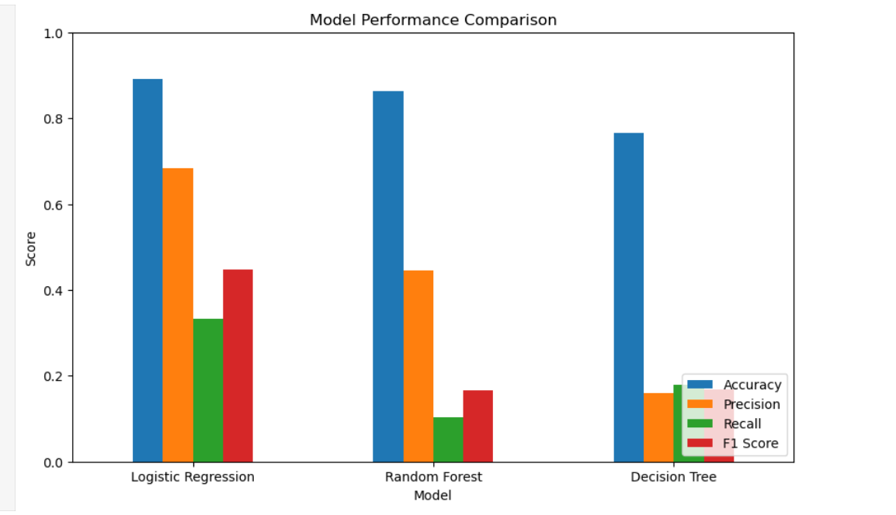
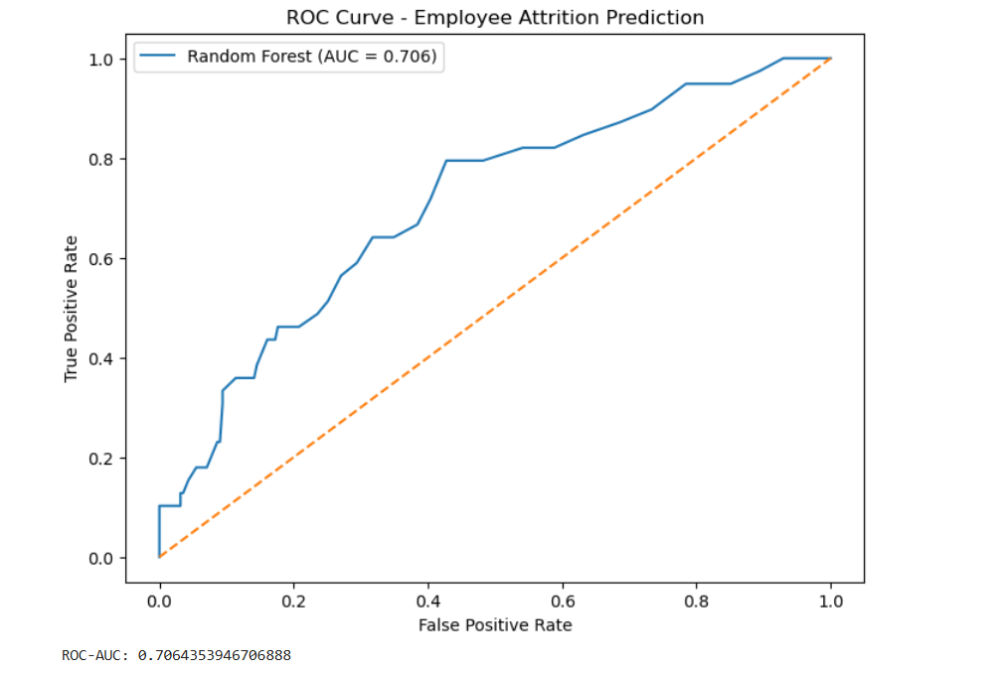

# 📊 Employee Attrition Prediction

An end-to-end Machine Learning project that analyzes employee attrition patterns and predicts whether an employee is likely to leave an organization.

The project combines **Exploratory Data Analysis (EDA), statistical insights, feature analysis, and classification models** to identify the major factors associated with employee turnover.

---

## 🎯 Project Objective

Employee attrition can significantly affect recruitment costs, productivity, and workforce stability.

The objective of this project is to:

- Analyze employee attrition patterns
- Identify factors associated with employee turnover
- Compare multiple classification algorithms
- Evaluate model performance using classification metrics
- Identify important features influencing attrition
- Build a predictive model that can help identify employees at higher risk of leaving

---

## 📌 Key Highlights

- 📊 Exploratory Data Analysis on employee demographics and workplace factors
- 🔎 Attrition analysis across job roles, satisfaction levels, overtime, travel, and job levels
- 🤖 Comparison of Logistic Regression, Random Forest, and Decision Tree models
- 📈 ROC-AUC evaluation
- 🧩 Confusion matrix analysis
- 🔍 Feature importance and coefficient analysis
- ⚖️ Balanced Logistic Regression to address class imbalance
- 📁 Organized visualizations and trained models

---

## 🛠️ Tech Stack

### Programming & Analysis
- 🐍 **Python** — Data analysis, preprocessing, and machine learning
- 🐼 **Pandas** — Data manipulation and analysis
- 🔢 **NumPy** — Numerical computations

### Data Visualization
- 📊 **Matplotlib** — Data visualization and analytical charts
- 🎨 **Seaborn** — Statistical visualization

### Machine Learning
- 🤖 **Scikit-learn** — Model development and evaluation
- 📈 **Logistic Regression** — Classification baseline
- 🌲 **Random Forest** — Ensemble classification model
- 🌳 **Decision Tree** — Tree-based classification model

### Development Environment
- 📓 **Jupyter Notebook** — Analysis, experimentation, and documentation
- 🧑‍💻 **VS Code** — Project development and code management
- 🔧 **Git & GitHub** — Version control and project hosting

## 🗂️ Dataset

The project uses the **IBM HR Analytics Employee Attrition dataset**.

The dataset contains employee-level information such as:

- Age
- Monthly Income
- Job Role
- Job Level
- Job Satisfaction
- Environment Satisfaction
- Business Travel
- Distance From Home
- Overtime
- Years at Company
- Years in Current Role
- Years with Current Manager
- Years Since Last Promotion
- Number of Companies Worked
- Marital Status
- Department
- Employee Attrition

## 📁 Project Structure

```text
Employee-Attrition-Prediction/
│
├── data/
│   ├── raw/
│   │   └── WA_Fn-UseC_-HR-Employee-Attrition.csv
│   └── processed/
│
├── images/
│   ├── charts/
│   │   ├── attrition_by_business_travel.png
│   │   ├── attrition_by_environment_satisfaction.png
│   │   ├── attrition_by_job_level.png
│   │   ├── attrition_by_job_role.png
│   │   ├── attrition_by_job_satisfaction.png
│   │   ├── attrition_by_overtime.png
│   │   ├── attrition_distribution.png
│   │   ├── balanced_logistic_confusion_matrix.png
│   │   ├── distance_from_home_vs_attrition.png
│   │   ├── feature_importance.png
│   │   ├── final_logistic_confusion_matrix.png
│   │   ├── model_performance.png
│   │   ├── monthly_income_vs_attrition.png
│   │   ├── random_forest_confusion_matrix.png
│   │   ├── roc_curve.png
│   │   └── years_at_company_vs_attrition.png
│
├── models/
│   ├── employee_attrition_config.pkl
│   └── employee_attrition_model.pkl
│
├── python/
│   ├── models/
│   └── notebooks/
│       └── employee_attrition_analysis.ipynb
│
├── powerbi/
├── reports/
├── sql/
├── docs/
│
├── .gitignore
└── README.md

```markdown
## 🔗 Key Files

| Resource | Description |
|---|---|
| [Dataset](data/raw/WA_Fn-UseC_-HR-Employee-Attrition.csv) | IBM HR Employee Attrition dataset |
| [Analysis Notebook](python/notebooks/employee_attrition_analysis.ipynb) | Complete EDA, preprocessing, modeling and evaluation |
| [Trained Model](models/employee_attrition_model.pkl) | Final trained Logistic Regression model |
| [Model Configuration](models/employee_attrition_config.pkl) | Model configuration and preprocessing information |
| [Charts](images/charts/) | Project visualizations and model evaluation charts |

### Target Variable

`Attrition`

| Value | Meaning |
|---|---|
| Yes | Employee left the organization |
| No | Employee stayed |

---
```

---

## 📊 Key Visualizations

### 1. Attrition Distribution



### 2. Attrition by Overtime



### 3. Attrition by Job Role



### 4. Attrition by Job Satisfaction



### 5. Monthly Income vs Attrition



### 6. Feature Importance



### 7. Model Performance



### 8. ROC Curve



---

## 💡 Key Business Insights

The analysis highlights several employee attributes associated with attrition:

- ⏰ **Overtime:** Overtime is an important factor to consider when assessing employee attrition risk.
- ✈️ **Business Travel:** Employees with different travel frequencies show different attrition patterns.
- 😊 **Job Satisfaction:** Lower satisfaction levels are associated with higher employee attrition risk.
- 🏢 **Environment Satisfaction:** Workplace environment satisfaction provides additional insight into employee turnover.
- 💼 **Job Level & Role:** Attrition patterns vary across different job levels and job roles.
- 💰 **Monthly Income:** Compensation levels show a relationship with employee attrition patterns.
- 📍 **Distance From Home:** Commuting distance is another factor considered in the attrition analysis.
- 📅 **Years at Company:** Employee tenure helps identify differences in attrition patterns across experience levels.
- 🎯 **Feature Importance:** Feature analysis was used to identify the variables contributing most to the predictive model.

These findings can help HR teams focus retention efforts on employees and workforce segments with higher potential attrition risk.

## 💡 Key Business Insights

- **Overtime is a major attrition indicator** — employees working overtime show noticeably higher attrition.
- **Job satisfaction is associated with employee retention** — lower satisfaction levels are linked with increased attrition.
- **Job role influences attrition risk** — attrition varies considerably across different job roles.
- **Business travel affects retention** — employees with frequent business travel show different attrition patterns.
- **Job level and compensation matter** — employee seniority and monthly income show meaningful relationships with attrition.
- **Distance from home can influence attrition** — employees living farther from the workplace exhibit different attrition patterns.
- **Tenure matters** — years at the company provides useful insight into employee retention and potential turnover risk.

These findings can help HR teams identify higher-risk employee segments and design targeted retention strategies.

## 🤖 Model Performance

Three classification approaches were evaluated for employee attrition prediction:

| Model | Purpose |
|---|---|
| Logistic Regression | Interpretable baseline classification model |
| Balanced Logistic Regression | Addresses class imbalance |
| Random Forest | Non-linear ensemble model for improved predictive performance |

Model performance was evaluated using:

- Accuracy
- Precision
- Recall
- F1-score
- ROC-AUC
- Confusion Matrix

The project also compares model predictions using ROC curves and confusion matrices to understand both overall performance and classification errors.

## 📌 Results & Business Recommendations

### Key Findings

The analysis identifies several employee characteristics associated with attrition risk, including:

- Overtime and workload
- Job satisfaction
- Job role
- Business travel
- Job level
- Monthly income
- Distance from home
- Years at the company

### Recommended HR Actions

1. **Monitor overtime workload**  
   Identify employees with sustained overtime and review workload distribution.

2. **Improve employee satisfaction**  
   Use regular feedback and engagement initiatives to identify dissatisfaction early.

3. **Develop role-specific retention strategies**  
   Analyze high-attrition roles and introduce targeted engagement and career-development programs.

4. **Review compensation and career progression**  
   Ensure compensation and promotion opportunities remain competitive across job levels.

5. **Use predictive analytics for early intervention**  
   Apply the trained model to identify employees who may require proactive retention support.

> **Note:** Model predictions should support HR decision-making rather than replace human judgment. They should be used alongside employee feedback, organizational context, and appropriate privacy and fairness practices.


## 🚀 How to Run

### 1. Clone the Repository

```bash
git clone https://github.com/himan6huu/Employee-Attrition-Prediction.git
cd Employee-Attrition-Prediction
```

### 2. Install Dependencies

```bash
pip install pandas numpy matplotlib seaborn scikit-learn jupyter
```

### 3. Launch Jupyter Notebook

```bash
jupyter notebook
```

Open:

```text
python/notebooks/employee_attrition_analysis.ipynb
```

### 4. Run the Analysis

Run the notebook cells sequentially to reproduce:

- Data preprocessing
- Exploratory data analysis
- Feature engineering
- Model training
- Model evaluation
- Feature importance analysis
- Visualization outputs
